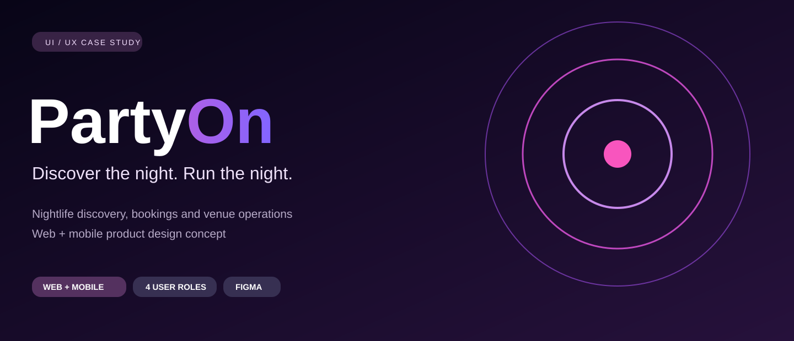
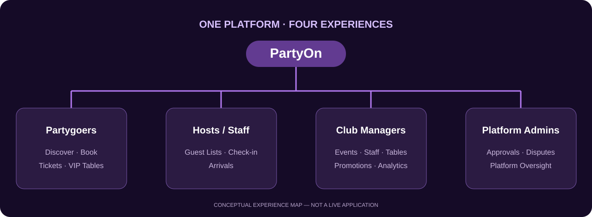

# PartyOn — Nightlife Discovery & Event Management

  <strong>Discover the night. Run the night.</strong> 
  A cross-platform design concept connecting nightlife discovery with event and venue operations.

  
  
  

## About PartyOn

**PartyOn** is a web and mobile nightlife platform concept designed around the entire event experience: **discovering parties, viewing events, selecting tickets, completing bookings, and managing venue operations**.

Unlike a simple event listing interface, PartyOn explores the needs of multiple user roles—from partygoers to event staff, club managers, and platform administrators.

### The challenge

Event discovery, reservations, tickets, guest check-ins, and venue management often happen across separate tools. PartyOn explores how these experiences can be brought together with clear, role-specific interfaces.

## The PartyOn ecosystem

| User role | Experience |
| --- | --- |
| **Partygoers** | Discover parties and clubs, explore events, choose tickets, reserve VIP tables, and manage bookings. |
| **Hosts & hostesses** | Access guest lists, track reservations, and handle guest check-in. |
| **Club managers** | Manage venues, events, promotions, staff, tables, and analytics views. |
| **Platform administrators** | Oversee venue approvals, users, payments-related dashboards, and disputes. |

## Website experience

The desktop designs explore **event discovery, featured promotions, detailed event pages, and ticket checkout**. The interface uses immersive nightlife imagery, dark surfaces, and contrasting calls to action.

## Mobile experience

The mobile designs explore a connected customer journey:

**Home feed → Discover → Event details → Ticket selection → Checkout**

The focus is on helping guests find relevant events, understand ticket pricing, and move through booking steps on a smaller screen.

## Original Figma designs

Both editable projects are available here:

- [Figma design — file 01](https://www.figma.com/design/ahJciX3q9M5dOLIuTCeWss?node-id=0-1)
- [Figma design — file 02](https://www.figma.com/design/1Niv7mppE8Y8ylm3UiLPNN?node-id=0-1)

## Skills demonstrated

**UI/UX Design · Figma · Web & Mobile Design · Information Architecture · Event Booking Flows · Role-Based Interfaces · Dashboard Design**

## Project status

This repository is a **UI/UX design case study**, not a live or deployed application. Payment, booking, and administration views are interface designs and should not be mistaken for functioning services.

---

**Kledi Rremi** · [GitHub](https://github.com/Kledi-Rremi) · [LinkedIn](https://www.linkedin.com/in/kledi-rremi-134066430/)
