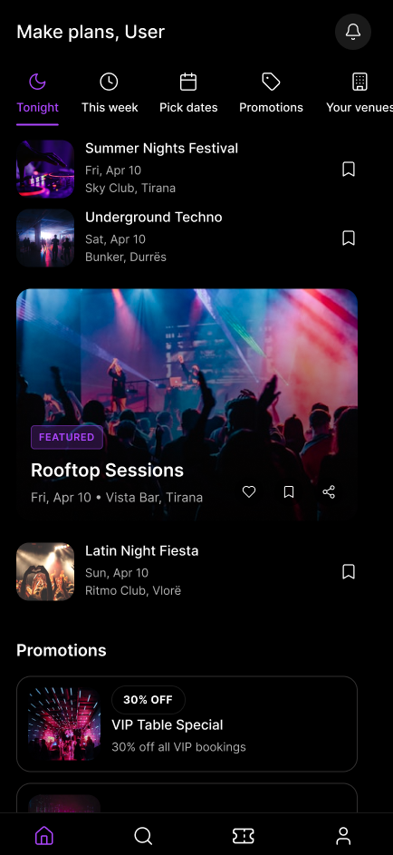
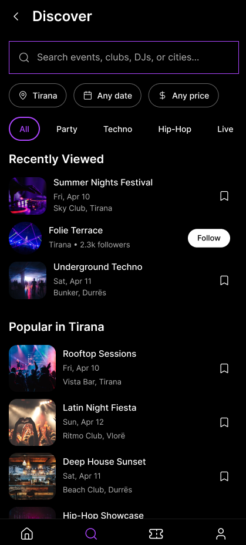
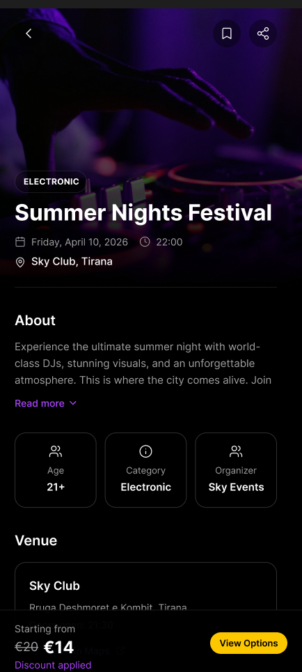
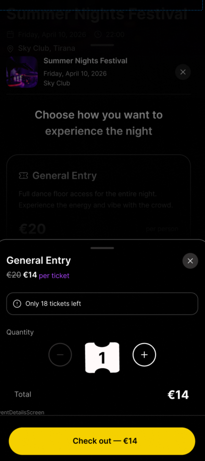
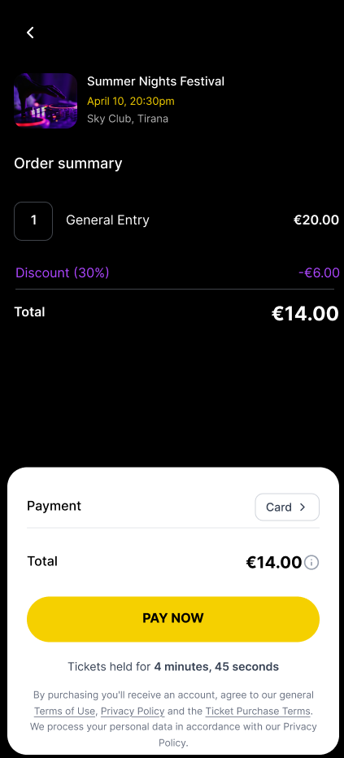
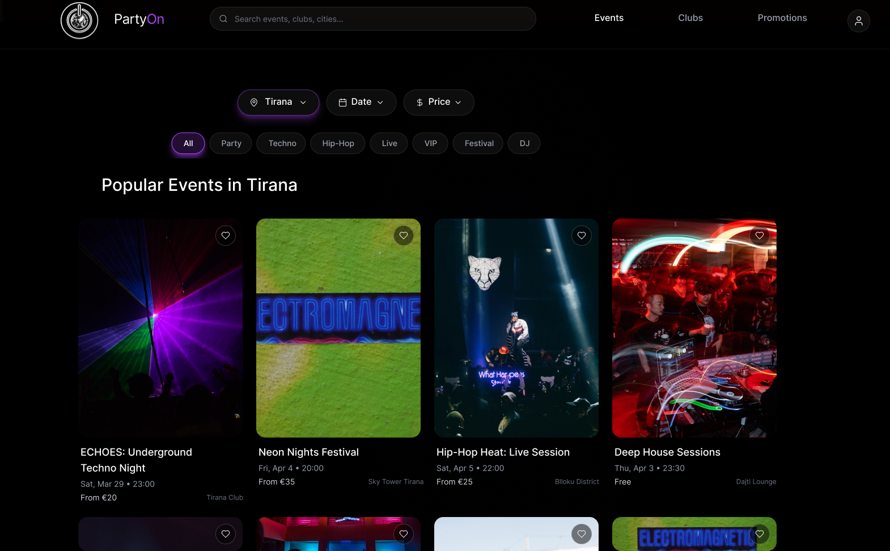
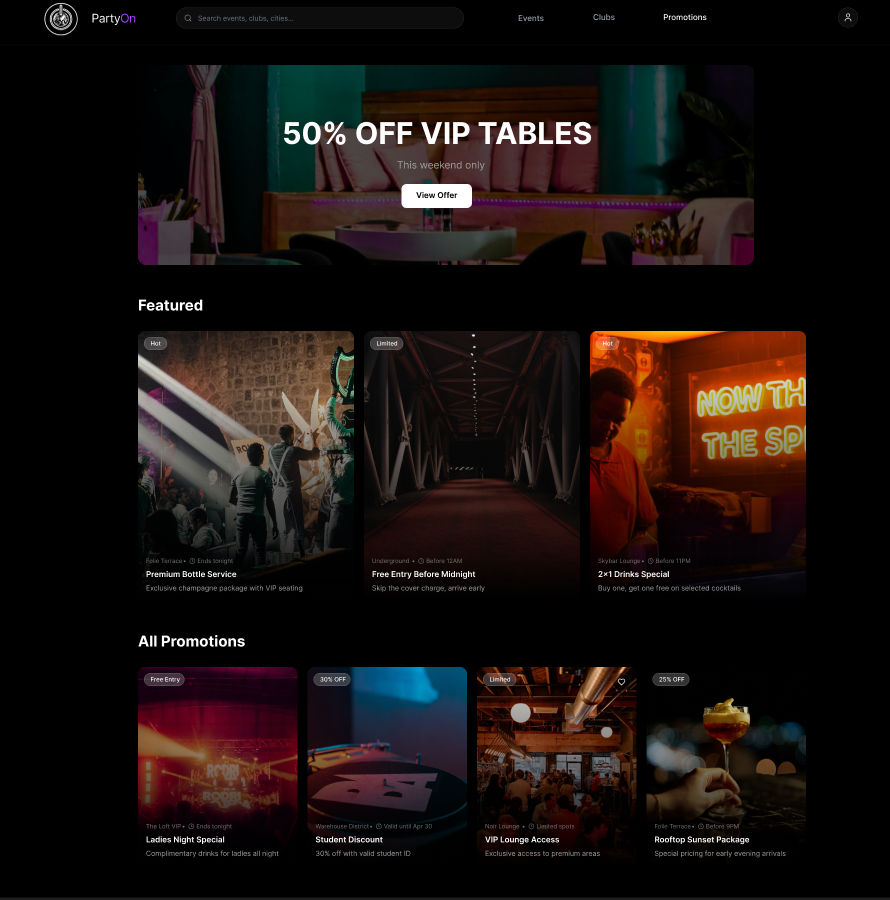
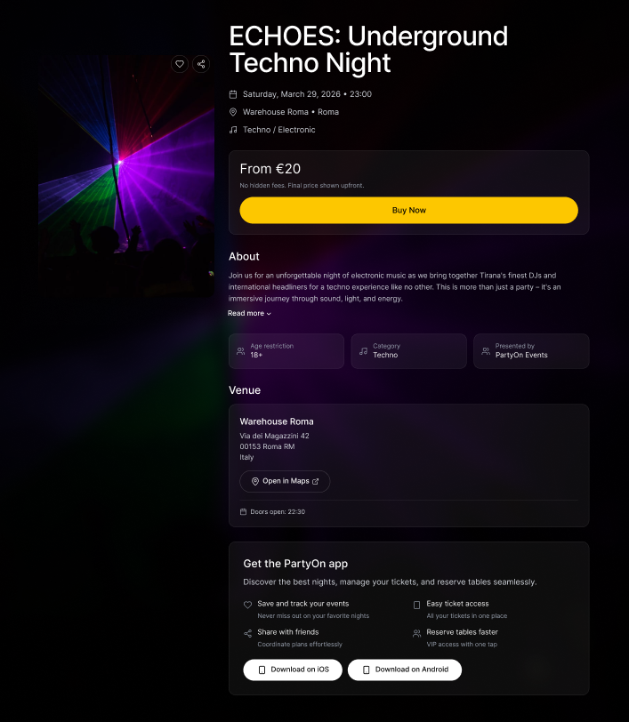
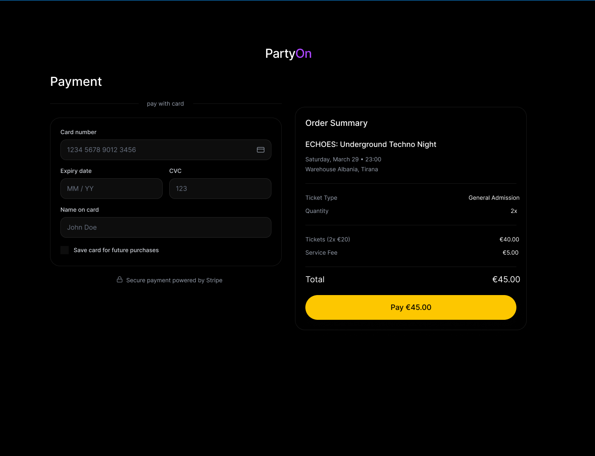

# PartyOn — Nightlife Discovery & Event Management

  <strong>Discover the night. Run the night.</strong> 
  A cross-platform design concept connecting nightlife discovery with event and venue operations.

  
  
  

  <a href="#mobile-experience">Mobile journey</a> ·
  <a href="#website-experience">Website journey</a> ·
  <a href="#original-figma-designs">Explore the Figma files</a>

## About PartyOn

**PartyOn** is a web and mobile nightlife platform concept designed around the entire event experience: **discovering parties, viewing events, selecting tickets, completing bookings, and managing venue operations**.

Unlike a simple event listing interface, PartyOn explores the needs of multiple user roles—from partygoers to event staff, club managers, and platform administrators.

### The challenge

Event discovery, reservations, tickets, guest check-ins, and venue management often happen across separate tools. PartyOn explores how these experiences can be brought together with clear, role-specific interfaces.

The showcase below follows the **partygoer experience**: finding a night out, reviewing an event, choosing a ticket, and reaching checkout. Nine screens show how this journey is presented on mobile and desktop.

## Mobile experience

**01 Home → 02 Discover → 03 Event details → 04 Ticket selection → 05 Checkout**

The mobile journey starts with inspiration and moves toward a booking decision. The first three screens introduce the event; the final two focus on ticket quantity, pricing, and payment.

*Click any screenshot to open the full-size image.*

### Find a night out

<table>
  <tr>
    <th width="33%">01 · Home</th>
    <th width="33%">02 · Discover</th>
    <th width="33%">03 · Event details</th>
  </tr>
  <tr>
    <td align="center" valign="top">
      
      
Date shortcuts, featured events, and promotions introduce options for a night out.

    </td>
    <td align="center" valign="top">
      
      
Search and city, date, price, and category filters help narrow the choice. Recently viewed items keep earlier options accessible.

    </td>
    <td align="center" valign="top">
      
      
Event imagery leads into the date, venue, age restriction, and description. A persistent price bar keeps ticket options within reach.

    </td>
  </tr>
</table>

### Choose a ticket and review the total

<table>
  <tr>
    <th width="50%">04 · Ticket selection</th>
    <th width="50%">05 · Checkout</th>
  </tr>
  <tr>
    <td align="center" valign="top">
      
      
A bottom sheet brings ticket availability, the discounted price, quantity controls, and the total into one focused step.

    </td>
    <td align="center" valign="top">
      
      
The order summary shows the ticket, discount, and final total. A contrasting payment panel groups the payment method and Pay Now action.

    </td>
  </tr>
</table>

## Website experience

**01 Browse events → 02 Explore promotions → 03 Review an event → 04 Checkout**

The desktop showcase moves from browsing and offers to event information and payment. Wider layouts give imagery, event details, and order summaries room to sit alongside each other.

### 01 · Event discovery

A searchable event grid supports browsing by city, date, price, and category. Each card pairs a strong image with the event name, date, starting price, and venue; save controls stay attached to the event.

  

### 02 · Promotions

A featured offer introduces the page, followed by featured promotions and a wider offer grid. Discount and availability badges make each offer's main detail visible while browsing.

  

### 03 · Event details

The event page brings together imagery, date and location, starting price, description, entry requirements, and venue information. The yellow Buy Now action sits near the price before the longer supporting details.

  

### 04 · Payment

The checkout design places card inputs beside the order summary. Ticket quantity, service fee, and the final total remain visible next to the payment action.

  

## Design direction

| Design choice | How it appears in the interface |
| --- | --- |
| **Dark surfaces and event imagery** | Nightlife photography leads the discovery screens, with dark backgrounds carrying through to event details and checkout. |
| **Purple selection accents** | Active navigation, selected filters, and discounted prices share a recurring accent color. |
| **Yellow booking actions** | View Options, Buy Now, Checkout, and Pay Now stand out at the point where the user moves to the next booking step. |
| **Information in stages** | Discovery introduces the event; details explain the experience; ticket selection and checkout focus on quantity and cost. |
| **Layouts suited to each screen** | Mobile uses a bottom sheet and persistent booking bar; desktop uses card grids and a payment layout with two columns. |

## The PartyOn ecosystem

The customer journey sits within a broader concept for event and venue operations. The experience map outlines the four roles explored in the project.

| User role | Experience |
| --- | --- |
| **Partygoers** | Discover parties and clubs, explore events, choose tickets, reserve VIP tables, and manage bookings. |
| **Hosts & hostesses** | Access guest lists, track reservations, and handle guest check-in. |
| **Club managers** | Manage venues, events, promotions, staff, tables, and analytics views. |
| **Platform administrators** | Oversee venue approvals, users, payments-related dashboards, and disputes. |

## Original Figma designs

Both editable projects are available here:

- [Figma design — file 01](https://www.figma.com/design/ahJciX3q9M5dOLIuTCeWss?node-id=0-1)
- [Figma design — file 02](https://www.figma.com/design/1Niv7mppE8Y8ylm3UiLPNN?node-id=0-1)

## Skills demonstrated

**UI/UX Design · Figma · Web & Mobile Design · Information Architecture · Event Booking Flows · Role-Based Interfaces · Dashboard Design**

## Project status

This repository is a **UI/UX design case study**, not a live or deployed application. Payment, booking, and administration views are interface designs and should not be mistaken for functioning services.

---

**Kledi Rremi** · [GitHub](https://github.com/Kledi-Rremi) · [LinkedIn](https://www.linkedin.com/in/kledi-rremi-134066430/)
